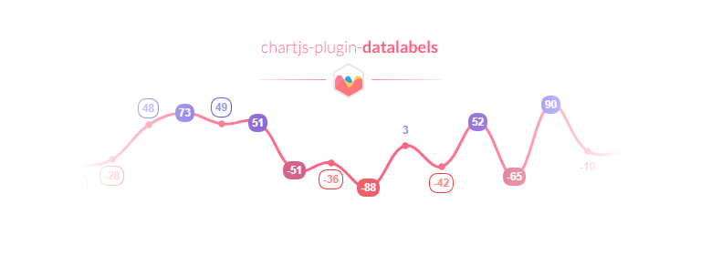

Highly customizable [Chart.js](http://www.chartjs.org/) plugin that displays labels on data for any type of charts.

**Important:** requires [Chart.js](https://github.com/chartjs/Chart.js/releases) **2.7.0** or later.

## Table of Contents



## License

`chartjs-plugin-datalabels` is available under the [MIT license](https://github.com/chartjs/chartjs-plugin-datalabels/blob/master/LICENSE.md).
