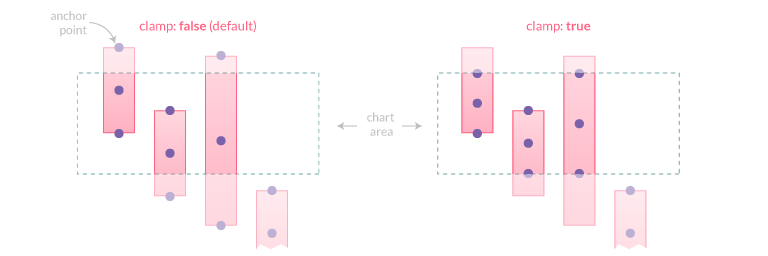

# Positioning

## Anchoring

An anchor point is defined by an orientation vector and a position on the data element. The orientation depends on the scale type (vertical, horizontal or radial). The position is calculated based on the `anchor` option and the orientation vector.

Supported values for `anchor`:
- `'center'` (default): element center
- `'start'`: lowest element boundary
- `'end'`: highest element boundary


## Clamping

The `clamp` option, when `true`, enforces the anchor position to be calculated based on the *visible geometry* of the associated element (i.e. part inside the chart area).



::: tip
If the element is fully hidden (i.e. entirely outside the chart area), anchor points will **not** be adjusted and thus will also be outside the viewport.
:::

## Alignment and Offset

The `align` option defines the position of the label relative to the anchor point position and orientation. Its value can be expressed either by a number representing the clockwise angle (in degree) or by one of the following string presets:

- `'center'` (default): the label is centered on the anchor point
- `'start'`: the label is positioned before the anchor point, following the same direction
- `'end'`: the label is positioned after the anchor point, following the same direction
- `'right'`: the label is positioned to the right of the anchor point (0°)
- `'bottom'`: the label is positioned to the bottom of the anchor point (90°)
- `'left'`: the label is positioned to the left of the anchor point (180°)
- `'top'`: the label is positioned to the top of the anchor point (270°)

The `offset` represents the distance (in pixels) to pull the label *away* from the anchor point. This option is **not applicable** when `align` is `'center'`. Also note that if `align` is `'start'`, the label is moved in the opposite direction. The default value is `4`.


## Rotation

This option controls the clockwise rotation angle (in degrees) of the label, the rotation center point being the label center. The default value is `0` (no rotation).

## Visibility

The `display` option controls the visibility of labels and accepts the following values:

- `true` (default): the label is drawn
- `false`: the label is hidden
- `'auto'`: the label is hidden if it [overlap](#overlap) with another label

This option is [scriptable](options.md#scriptable-options), so it's possible to show/hide specific labels:

```javascript
display: function(context) {
  return context.dataIndex % 2; // display labels with an odd index
}
```

## Overlap

The `display: 'auto'` option can be used to prevent overlapping labels, based on the following rules when two labels overlap:

- if both labels are `display: true`, they will be drawn overlapping
- if both labels are `display: 'auto'`, the one with the highest data index will be hidden. If labels are at the same data index, the one with the highest dataset index will be hidden
- if one label is `display: true` and the other one is `display: 'auto'`, the one with `'auto'` will be hidden (whatever the data/dataset indices)

::: tip
Labels with `display: false` don't contribute to the overlap detection.
:::

## Clipping

When the `clip` option is `true`, the part of the label which is outside the chart area will be masked (see [CanvasRenderingContext2D.clip()](https://developer.mozilla.org/en-US/docs/Web/API/CanvasRenderingContext2D/clip))
