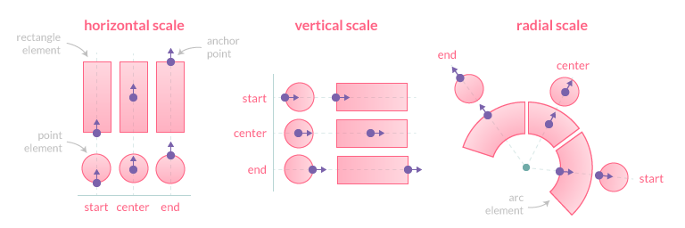
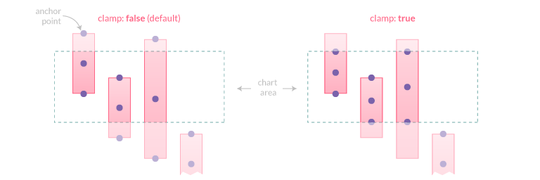

# 位置

## 锚点

锚点位置由向量方向、数据项位置和锚点配置决定。向量方向由坐标轴类型决定（如：直角坐标系（vertical、horizontal），径向坐标轴）。

`anchor` 可选配置如下：
- `'center'` (默认值): 数据项中间
- `'start'`: 数据项开始的边界位置
- `'end'`: 数据项结束的边界位置



## Clamping

`clamp` 配置为 `true` 时表示锚点位置会在元素可见区域内计算。



::: tip
当元素被隐藏时（即不在图表可视区域内），锚点位置**不会**被调整，因此锚点也会被隐藏。
:::

## 对齐和偏移

`align` 配置项定义标签相对于锚点的位置和方向。`align` 取值可为数字（顺时针角度，如：配置饼图这类的标签）或者字符串，字符串取值如下：

- `'center'` (默认值): 在锚点的中心
- `'start'`: 锚点之前
- `'end'`: 锚点之后
- `'right'`: 锚点右边（0°）
- `'bottom'`: 锚点下边（90°）
- `'left'`: 锚点左侧（180°）
- `'top'`: 锚点上边（270°）

`offset` 配置项表示标签距离锚点的位置（单位为像素），默认值为 `4`。


## 旋转

`Rotation` 属性配置标签的旋转角度，旋转中心为标签中心。

## 显示和隐藏

`display` 属性控制标签的显示和隐藏，可选值如下：

- `true` (默认值): 显示
- `false`: 隐藏
- `'auto'`: 如何和其他标签重叠则隐藏，查看[overlap](#overlap)

`display` 支持脚本化[脚本配置项](options.md#脚本配置项)，可配置为函数类型：

```javascript
display: function(context) {
    return context.dataIndex % 2; // display labels with an odd index
}
```

## Overlap

`display: 'auto'` 属性可防止标签重叠，重叠时展示规则如下：

- 如果两个标签配置都是`display: 'true'`，他们都会被绘制。
- 如果两个标签配置都是`display: 'auto'`，数据（data）索引最高的那个将被隐藏。如果标签位于相同的数据索引，则具有最高数据集（dataset）索引的标签将被隐藏。
- 如果一个标签配置是`display: 'true'`，另一个标签是`display: 'auto'`，带有`auto`的标签将被隐藏.

::: tip
`display: false` 的标签不会影响覆盖计算。
:::

## Clipping

`clip: 'true'` 时表示当标签超出图表绘制区域是是否隐藏，(参考 [CanvasRenderingContext2D.clip()](https://developer.mozilla.org/en-US/docs/Web/API/CanvasRenderingContext2D/clip))
